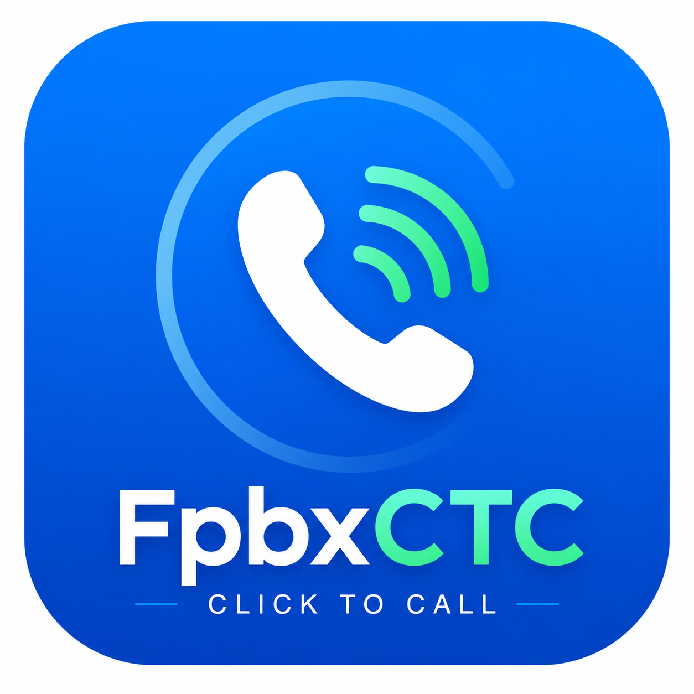

<p align="center">
  
</p>

# FpbxCTC — FreePBX Click-to-Call for Windows

A lightweight Windows desktop app **and** browser extension that forward calls to a FreePBX-compatible PBX via its Click-to-Call REST API.

## Components

| Component | Description |
|---|---|
| **`FpbxCTC.exe`** | Windows desktop app — registers as the default `tel:` link handler |
| **`FpbxCTC-Setup.exe`** | Windows installer (Start Menu shortcut + Add/Remove Programs) |
| **`browser-extension/`** | Chrome / Edge / Firefox MV3 extension — right-click any selected number to dial |
| **`pbx_files/`** | Server-side files to deploy on your FusionPBX server |

---

## How it works

```
User selects / clicks a number
        │
        ├─ tel: link  →  Windows launches FpbxCTC.exe tel:+15551234567
        └─ selected text  →  browser extension right-click → "Call with FpbxCTC"
                │
                ▼
GET https://<domain>/ctc.php?api=1&key=<api_key>&agent=<agent>&dest=<number>
                │
                ▼
        PBX rings agent extension → agent answers → bridges to destination
```

---

## Features

- Native Windows GUI settings window (no browser, no Electron)
- One-click `tel:` protocol registration / unregistration
- **Install the browser extension directly from the Settings window** — extracts to `%APPDATA%\FpbxCTC\extension\`, auto-fills settings via `bootstrap.json`, and opens Chrome or Edge at the extensions page
- Browser extension with right-click context menu for any selected phone number
- Instant OS notification on call success or failure
- Robust number sanitisation — strips everything except digits (`0–9`) in both the desktop app and extension, handling `+1-555 (123) 4567`, `tel:` prefixes, spaces, dashes, dots, and parentheses
- Config saved to `%APPDATA%\FpbxCTC\config.json` (desktop) and `chrome.storage.sync` (extension)
- Extension settings auto-populated on first install from `bootstrap.json` written by the desktop app
- Application icon embedded in the EXE and extension
- Professional installer with Start Menu shortcut and Add/Remove Programs entry

---

## PBX server setup

Copy the files from `pbx_files/` to your FusionPBX server:

| File | Destination |
|---|---|
| `ctc.php` | `/var/www/fspbx/public/ctc.php` |
| `ctc.lua` | `/usr/share/freeswitch/scripts/ctc.lua` |

Then edit the placeholders at the top of each file:

```php
// ctc.php
define('GATEWAY', 'YOUR-GATEWAY-UUID-HERE');
```

```lua
-- ctc.lua
local GATEWAY    = "YOUR-GATEWAY-UUID-HERE"
local CID_NUMBER = "15550000000"   -- your outbound caller ID
```

Your gateway UUID is in FusionPBX → **Accounts → Gateways** → click your gateway → copy the UUID from the URL.

---

## Prerequisites

### Desktop app (`FpbxCTC.exe`)

| Requirement | Version | Download |
|---|---|---|
| Go | 1.22 + | https://go.dev/dl/ |

### Installer (`FpbxCTC-Setup.exe`)

| Requirement | Download |
|---|---|
| Rust + Cargo | https://rustup.rs/ |
| Visual Studio 2022 with **Desktop development with C++** workload | https://visualstudio.microsoft.com/ |

After installing Rust and the VS C++ workload, install the installer CLI once:

```powershell
cargo install installrs --locked
```

### Browser extension

No build step needed — load the `browser-extension/` folder directly.  
Run `build.bat` first to generate the icons.

---

## Building

### Desktop app only

```bat
build.bat
```

### Desktop app + installer

```bat
build_installer.bat
```

Both scripts automatically prepend Go and Cargo to `PATH`, so they work even from a fresh terminal.

**What the build scripts do:**
1. Convert `FpbxCTC.png` → `FpbxCTC.ico` (via `tools/mkico`)
2. Resize `FpbxCTC.png` → `browser-extension/icons/` at 16 / 32 / 48 / 128 px (via `tools/mkicons`)
3. ZIP `browser-extension/` → `browser-extension.zip` (via `tools/mkzip`, embedded into the EXE)
4. Embed the ICO into `FpbxCTC.exe` (via `github.com/akavel/rsrc`)
5. `go mod tidy` + `go build` → `FpbxCTC.exe`
6. *(installer only)* Copy EXE + ICO to `installer/`
7. *(installer only)* `installrs build` → `FpbxCTC-Setup.exe`

---

## Browser extension

### Option A — Install from the desktop app (recommended)

1. Open **FpbxCTC.exe** → Settings window
2. Fill in your domain, API key, and agent number, then click **Save Settings**
3. Click **Install Browser Extension**
   - Extracts the extension to `%APPDATA%\FpbxCTC\extension\`
   - Writes `bootstrap.json` with your current settings
   - Opens a helper window with **Open Chrome Extensions Page** / **Open Edge Extensions Page** buttons
4. In the browser: enable **Developer mode** → **Load unpacked** → select the folder shown
5. Open the extension popup — settings are pre-filled automatically from `bootstrap.json`

### Option B — Load from source

1. Run `build.bat` (generates icons and the extension ZIP)
2. Open `chrome://extensions` (Chrome) or `edge://extensions` (Edge)
3. Enable **Developer mode** → **Load unpacked** → select the `browser-extension/` folder
4. Click the FpbxCTC icon in the toolbar and enter your settings

**Right-click flow:** Highlight any phone number on any page → right-click → **"Call with FpbxCTC"** → your phone rings, then bridges to the destination.

---

## Desktop app — first-time setup

1. Run **FpbxCTC.exe** (or install via **FpbxCTC-Setup.exe**)
2. Fill in:
   - **Domain** — PBX hostname without `https://` (e.g. `pbx.example.com`)
   - **API Key** — generated in the `ctc.php` web UI
   - **Agent Number** — your desk extension (digits only; formatting stripped automatically)
3. Click **Save Settings**
4. Click **Register as tel: handler**
5. On Windows 11: click **Open Windows Default Apps** and confirm FpbxCTC as the `tel:` handler
6. *(Optional)* Click **Install Browser Extension** to set up the Chrome / Edge extension with settings pre-filled

---

## Project structure

```
FpbxCTC/
├── main.go                        # Entry point — call mode or settings mode
├── config.go                      # Config struct, load/save to %APPDATA%
├── caller.go                      # Number sanitisation + HTTP API call
├── registry.go                    # Windows registry tel: handler registration
├── settings.go                    # Native GUI settings window (gonutz/wui)
├── extinstall.go                  # Embed + extract browser-extension.zip, detect browsers
├── FpbxCTC.png                    # Source icon (all other icon formats generated from this)
├── browser-extension.zip          # Generated by build.bat — embedded into FpbxCTC.exe (gitignored)
├── go.mod / go.sum
├── build.bat                      # Build FpbxCTC.exe (icons + zip + embed + compile)
├── build_installer.bat            # Build FpbxCTC-Setup.exe
├── tools/
│   ├── mkico/main.go              # PNG → ICO (pure Go, no CGO)
│   ├── mkicons/main.go            # PNG → 16/32/48/128 px PNGs (pure Go, no CGO)
│   └── mkzip/main.go              # Folder → ZIP for embedding extension (pure Go)
├── installer/
│   ├── Cargo.toml                 # Rust installer crate (installrs)
│   └── src/lib.rs                 # Install / uninstall logic
├── browser-extension/
│   ├── manifest.json              # MV3 — Chrome, Edge, Firefox
│   ├── background.js              # Service worker: context menu + API call + notifications
│   ├── icons/                     # Generated by build.bat (gitignored)
│   └── popup/
│       ├── popup.html             # Settings UI
│       ├── popup.css              # Dark theme
│       └── popup.js               # Load/save via chrome.storage.sync; bootstrap.json auto-fill
└── pbx_files/
    ├── ctc.php                    # FusionPBX web UI + API endpoint
    └── ctc.lua                    # FreeSwitch Lua script (call flow)
```

---

## Configuration

**Desktop** — `%APPDATA%\FpbxCTC\config.json` (never committed):

```json
{
  "domain": "pbx.example.com",
  "api_key": "your-api-key-here",
  "agent_number": "1001"
}
```

**Browser extension** — stored in `chrome.storage.sync` (syncs across devices when signed in to Chrome/Edge).

On first install the extension also reads `bootstrap.json` from its own folder (written by **Install Browser Extension** in the desktop app) to auto-populate and save settings:

```json
{
  "domain": "pbx.example.com",
  "api_key": "ctc_sk_...",
  "agent_number": "1001"
}
```

---

## License

MIT — see [LICENSE](LICENSE).
